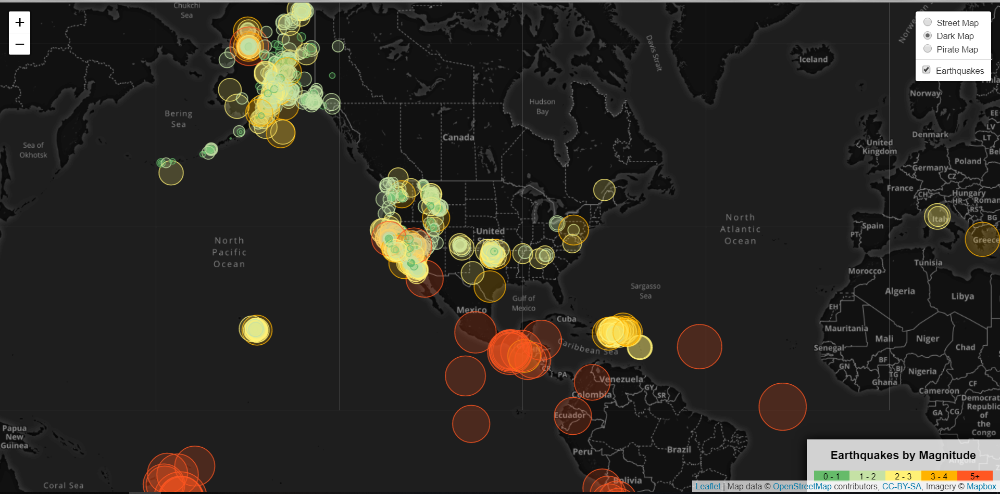

# Visualizing Data with Leaflet
Geo-Mapping Earthquake Data

In this challenge, we are using the GeoJSON data from USGS GeoJSON Feed page to visualize the earthquake data from all over the world. The objective of this assignment is to create a meaningful visualization to better educate the public and other government oraganizations on issues facing our planet.

<<<<<<< HEAD

=======

>>>>>>> c426798563d8d76806a0cfdd17ca43c4a46cfeb7
